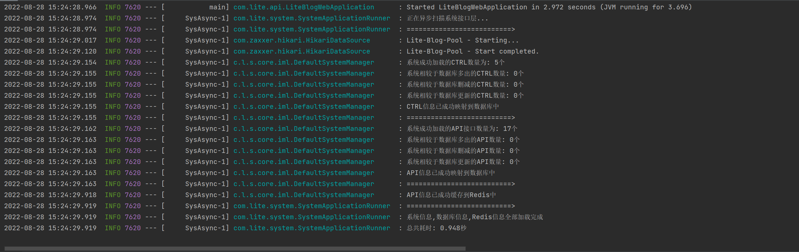

# Lite-Blog -- 轻量简洁的博客后台系统

------

## 前言


作者在写这个博客的时候还只是一个大二的学生，水平能力极其有限。

这个博客是作者第一次从独立搭建框架到完成所有功能的项目，用手一点点敲出来的，没有用任何的后端框架。

中间走了很多的坑，碰了很多的雷，也许项目本身并不完美，也许代码可能也会很烂，不过好歹是自己一点点写出来的。

有了这次的经历，以后编写代码时会有更多可以借鉴的地方且避免同样的事情再次发生。

希望以后在后端的路上可以越走越远，能够达成自己想要的目标。


## 开发说明


**数据库SQL构建脚本位于 :**`Lite-Blog-Api/src/main/resources/dbScript/lite_blog_2022_8_28_15_11.sql`


**POST接口调试导出数据位于:**`Lite-Blog-Api/src/main/resources/postmanCollection/lite-blog.postman_collection_latest.json`


**项目的配置文件位于：**`Lite-Blog-Api/src/main/resources/application-dev.yml`


**项目的语言文件位于：**`Lite-Blog-Common/src/main/resources/i18n/messages.properties`


## **版本要求**

- **Mysql：**`8.0.27`
- **Tomcat:**  `8.5.73`
- **RabbitMq:** `3.10.6`
- **Nginx:** `1.16.1`
- **Redis:**`3.0.504`
- **Maven:**`3.8.1`


## 模块


```
|
|
|----Lite-Blog                 Maven父工程
|
|-------Lite-Blog-Common       公共模块，语言管理，通用工具
|
|-------Lite-Blog-Auth         权限管理模块
|
|-------Lite-Blog-Cos          腾讯云COS对象存储模块
|
|-------Lite-Blog-Mail         邮件服务模块
|
|-------Lite-Blog-Mq           消息队列模块
|
|-------Lite-Blog-Generator    代码生成模块
|
|-------Lite-Blog-Schedule     定时任务模块
|
|-------Lite-Blog-Business     业务模块
|
|-------Lite-Blog-System       系统模块
|
|-------Lite-Blog-Api          Web接口Api模块
```


## 技术栈


**接口文档：**[项目概览 - 轻言博客 (apifox.cn)](https://www.apifox.cn/apidoc/shared-25197369-00c2-4c14-a603-1c453cfcc812/doc-881581)

**技术总栈**:[Lite-Blog-Doc/所用技术.md at main · CQUT-Programmer/Lite-Blog-Doc (github.com)](https://github.com/CQUT-Programmer/Lite-Blog-Doc/blob/main/dev/所用技术.md)

**登陆校验**：[Lite-Blog-Doc/Token校验.md at main · CQUT-Programmer/Lite-Blog-Doc (github.com)](https://github.com/CQUT-Programmer/Lite-Blog-Doc/blob/main/dev/Token校验.md)


**实体映射：**[CQUT-Programmer/Lite-Blog-Doc: Documentation repository for blog systems (github.com)](https://github.com/CQUT-Programmer/Lite-Blog-Doc/blob/main/dev/实体映射.md)


**邮件服务：**[Lite-Blog-Doc/邮件服务.md at main · CQUT-Programmer/Lite-Blog-Doc (github.com)](https://github.com/CQUT-Programmer/Lite-Blog-Doc/blob/main/dev/邮件服务.md)

**多语言配置**：[Lite-Blog-Doc/dev at main · CQUT-Programmer/Lite-Blog-Doc (github.com)](https://github.com/CQUT-Programmer/Lite-Blog-Doc/blob/main/dev/i18n多语言.md)

**腾讯COS：**[Lite-Blog-Doc/dev at main · CQUT-Programmer/Lite-Blog-Doc (github.com)](https://github.com/CQUT-Programmer/Lite-Blog-Doc/blob/main/dev/腾讯COS.md)

**接口权限：**[Lite-Blog-Doc/接口权限管理.md at main · CQUT-Programmer/Lite-Blog-Doc (github.com)](https://github.com/CQUT-Programmer/Lite-Blog-Doc/blob/main/dev/接口权限管理.md)

------

## 项目预览

即将推出


## 部分截图预览




## 部署文档

即将推出

